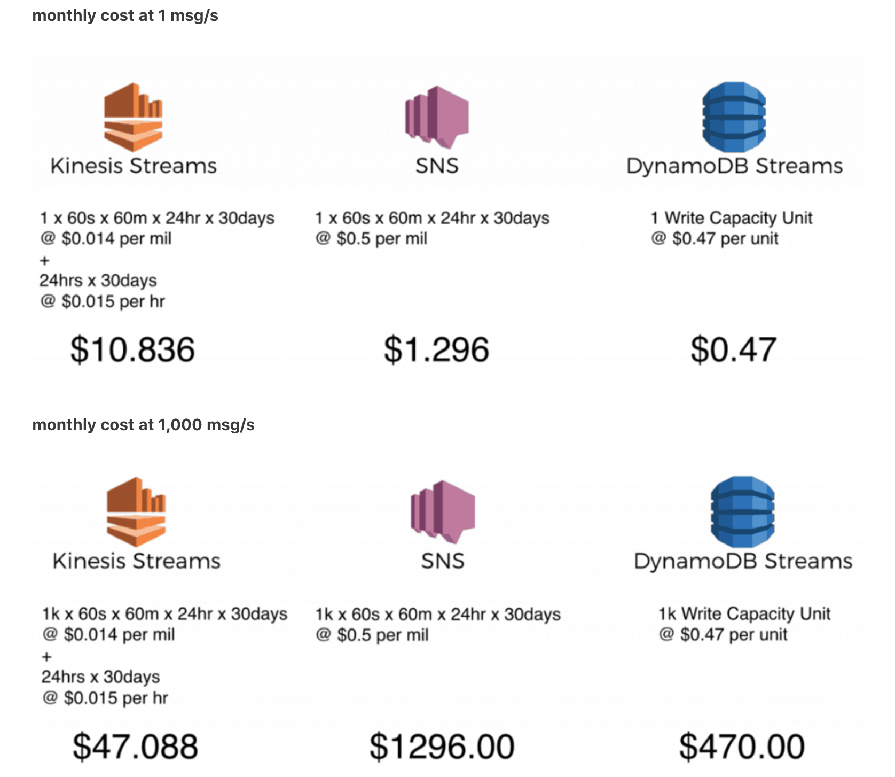

# Cloudformation Challenge

Deploy a SAM template which creates resources to :
- Successfully write to the DynamoDB Table once a POST request is received by the API Gateway.
- Add any required resources to send a message to a SNS Topic whenever a new item is added to the DynamoDB Table.

### Pre-requisites
Install the dependencies to run the template:
- aws-cli
- sam-cli

Please follow this https://docs.aws.amazon.com/serverless-application-model/latest/developerguide/serverless-sam-cli-install-mac.html to install the required dependencies first.


### Set up 

```sh
$ aws s3 mb s3://remember-to-delete-bucket
```

### Packaging with SAM 

```sh
$ sam package --template-file sam-template.yaml --s3-bucket remember-to-delete-bucket --output-template-file packaged.yaml
```

### Deployment 

```sh
$ sam deploy --template-file packaged.yaml --stack-name sam-stack  --capabilities CAPABILITY_IAM --parameter-overrides "MyName=emilyha"
```

### Testing
After the stack is deployed. Grab the RootUrl from the Outputs section of the stack. You can use postman or curl command to hit the endpoint : RootUrl/v1/add_new

```sh
{
  "team_country": "US",
  "team_name": "TeamPika",
  "team_desc": "Wild Pikachus",
  "team_rating": "brilliant"
}
```
Example curl:

```sh
curl -vvv -X POST -d '{
  "team_country": "Aus",
  "team_name": "TeamRocket",
  "team_desc": "Moon",
  "team_rating": "excellent"
}' -H "Content-Type: application/json" https://ddef0zucwa.execute-api.ap-southeast-2.amazonaws.com/v1/add_new
```

Expected result:
Status 201 
{}

### Clean up 
```sh
$ aws cloudformation delete-stack --stack-name sam-stack
$ aws s3api delete-bucket --bucket remember-to-delete-bucket --region ap-southeast-2
```

#### Improvements
- Better handling of Parameter validation in the lambda. Eg. To handle when incompatible data types are given instead of the accepted ‘string’ data type. 
- Configure TracingConfig to trace incoming requests with AWS X-ray 
- Unit Testing + Integration Tests
- Return a more informative response message.
- Cater for other http requests 
- Use Swagger to define api-gateway
- Authentication
- Check for Duplicate data (data already inserted) in lambda
- VPC configurations
- TAG all resources
- Cloudformation StackSet for multi region / multi-account deployment
- Use SQS FiFO queues for deduplication with MessageDeduplicationId (https://aws.amazon.com/blogs/aws/new-for-amazon-simple-queue-service-fifo-queues-with-exactly-once-delivery-deduplication/) 
- Use CodePipeline to trigger deployment when commits are made - one for production branch and one for master branch following Gitlab flow strategy. 
- Since I’ve chosen to use SAM, It would be nice to be integrated with CodeBuild and CodeDeploy for gradual code deployment.
- Try a serverless framework such as Architect (https://arc.codes/)
- You can create a an Analytics Pipeline by writing the DynamoDB stream records to Kinesis Firehose (using Lambda or a Kinesis Client Library application), then on to S3 for batching into Redshift.
- Replace use of dynamoDB Streams with Kinesis Streams to cut costs if feasible with architecture needs. 



### Todos
 - Licence


